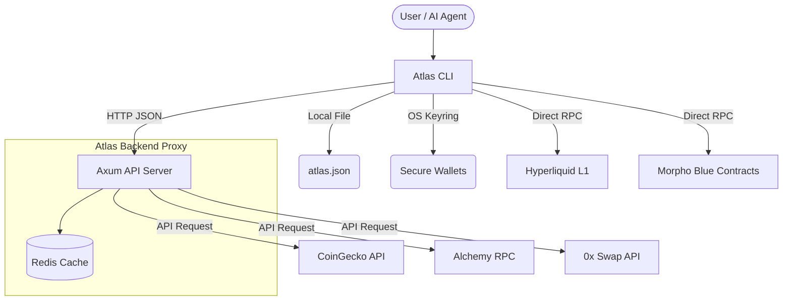

# Atlas OS — DeFi Operating System

Atlas OS is a modular, Unix-philosophy inspired Command Line Interface (CLI) and Backend proxy designed for interacting with Decentralized Finance (DeFi) protocols. It provides a unified platform for trading, lending, market analysis, and portfolio tracking across multiple blockchains.

Built in **Rust**, it prioritizes performance, security, and extensibility. 

## 🏗️ Architecture

Atlas OS is logically divided into two primary tiers:

1. **Atlas CLI (`atlas-cli`)**: The robust command-line interface that users and AI Agents interact with. It outputs structured JSON (or tables) for seamless programmatic consumption.
2. **Atlas Backend (`atlas-server`)**: An Axum-based API proxy server that abstracts away complex data aggregation, caches protocol responses (Redis), and securely manages third-party API keys (Alchemy, CoinGecko, 0x).



## 🔐 Security & Wallet Management

Atlas OS does **not** store private keys in plain text. It leverages the host OS's native secure keyring (e.g., macOS Keychain, Secret Service on Linux, Credential Vault on Windows) to encrypt and manage profile keys securely. 

Keys are mapped to "profiles" (e.g., `main`, `trading`, `testing`), allowing seamless switching across EVM and Hyperliquid accounts without repetitive signing.

```bash
# Generate a new secure wallet profile
atlas profile generate main

# Export (with explicit warning, formatted for LLMs)
atlas profile export main --output json
```

## ⚙️ Configuration (`atlas.json`)

All module settings, trading defaults, and system preferences are stored via `~/.atlas-os/atlas.json`.

- **Hyperliquid Module**: Network selection (`mainnet`/`testnet`), RPC URL.
- **Trading Configuration**: Default leverage amounts, slippage tolerance, margin type, sizing format.
- **ZeroX / Morpho Modules**: Explicit enable/disable toggles.

Configuration changes are done safely through the CLI to ensure schema validation:

```bash
atlas configure module enable zero_x
atlas configure trading leverage 10
atlas configure trading slippage 0.05
```

## 🧩 Protocol Modules

The core power of Atlas OS comes from its standardized protocol modules.

### 1. Hyperliquid (Perps, Spot, Vaults, Subs)
Provides direct RPC integration to the Hyperliquid L1 app-chain for low-latency perpetual and spot trading.

- **Market Data**: Orderbook, L1 Candlesticks, funding histories, open interest.
- **Trading**: Market, Limit, Stop orders. Slippage and dynamic leverage calculation.
- **Account**: Subaccount management, vault lifecycle, and agent wallet approvals.
- **Risk Calculation**: Internal mechanisms to compute liquidation levels and optimal position sizing offline.

### 2. Morpho Blue (Lending & Borrowing)
Interacts with Morpho's permissionless lending markets across Ethereum and Base.
- **Data**: Fetch live market data (Supply APY, Borrow APY, Utilization).
- **Positions**: Queries user borrowing limits, health factors, and total collateral.

### 3. ZeroX (0x) v2 DEX Aggregator
A multi-chain swap proxy module supporting ERC20 liquidty aggregation via the new *AllowanceHolder* unified flow.

- **Quotes**: Fetch indicative and firm swap transaction data across 19+ EVM chains.
- **Architecture**: `0x` API requests are proxied via the **Atlas Backend** to hide API keys (`ZEROX_API_KEY`) from local config, centralizing secret management. 

### 4. CoinGecko & Alchemy Integration
- **Portfolio**: Aggregates ERC20 balances across multiple chains, resolving metadata via Alchemy and pricing them with CoinGecko.
- **Analytics**: Market analysis tools (Top Movers, Trending DEX pools, OHLC).

## 📊 Technical Analysis (TA) & Streams
Atlas CLI provides built-in TA functions (via `ta-lib` equivalent implementations) capable of computing real-time:
- **RSI, MACD, VWAP, Bollinger Bands, Stoch, ADX, SMA/EMA**.

Data can also be **streamed** via WebSockets from integrated exchanges directly to the terminal stdout for agentic consumption.

## 🚀 Development

### Building the Project
Atlas OS is a Cargo workspace standardizing dependencies.

```bash
# Run tests
cargo test --workspace

# Build and run the Backend
cd apps/backend
cp .env.example .env # Add ALCHEMY_API_KEY, COINGECKO_API_KEY, ZEROX_API_KEY
cargo run

# Build the CLI
cargo build --release -p atlas-cli
./target/release/atlas doctor
```

### Adding new Modules
Each DeFi protocol should be siloed in its own crate under `crates/modules/[name]` and implement the unified trait interfaces in `crates/common/src/traits.rs` (e.g., `SwapModule`, `LendingModule`, `PerpModule`). Registration happens via the `Orchestrator` registry during application initialization.
